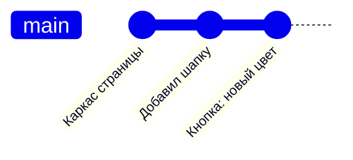
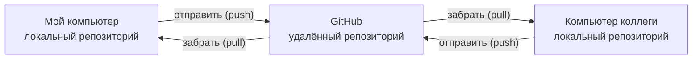

# 1. Зачем git

**Коротко.** Git — это машина времени для папки с проектом. Он хранит снимки
всех файлов в нужные тебе моменты, помнит, кто, когда и зачем их сделал, и даёт
нескольким людям работать над одной папкой, не затирая друг друга.

## Без git

Знакомо?

```
макет_финал.fig
макет_финал_2.fig
макет_финал_точно_последний.fig
макет_финал_правки_Пети.fig
```

Непонятно, какой файл главный, что поменялось между версиями и как собрать
правки двух людей в один файл. Git решает ровно эти три проблемы.

## Снимок — коммит

Когда работа дошла до осмысленной точки, ты говоришь git: «запомни, как сейчас
выглядят файлы». Такой снимок называется **коммит** (commit). У каждого коммита есть:

- **что** поменялось — git хранит снимок всех файлов и может показать разницу
  с прошлым снимком;
- **кто** и **когда** — автор и время;
- **зачем** — короткое сообщение, которое пишет автор: «Кнопка: новый цвет фона».

Коммиты выстраиваются в цепочку — это и есть **история** проекта.



К любому коммиту можно вернуться, сравнить два коммита или отменить один из них.

## Репозиторий

**Репозиторий** (repository, «репо») — папка проекта вместе со всей его историей.
Снаружи это обычная папка с файлами; история лежит внутри, в скрытой папке `.git`.
Её не трогают руками — с ней работает git.

## Git и GitHub — не одно и то же

| | Git | GitHub |
|---|---|---|
| Что это | программа, которая ведёт историю | сайт, где хранятся репозитории |
| Где живёт | на твоём компьютере | в интернете, github.com |
| Зачем | коммиты, ветки, история | общий доступ, Pull Request, ревью, проверки, задачи |

У каждого участника на компьютере своя копия репозитория — **локальная**. На GitHub
лежит общая — **удалённая** (remote). Работа идёт так: делаешь коммиты у себя,
потом отправляешь их на GitHub, чтобы увидели остальные. Как именно — в главе 4.



## Что git хранит хорошо, а что плохо

- **Хорошо:** текст — код, Markdown, JSON, конфиги. Git показывает разницу по строкам
  и умеет сам соединять правки разных людей.
- **Плохо:** большие двоичные файлы — картинки, видео, `.fig`. Git их хранит, но
  показать разницу или соединить две версии не может.
- **Никогда:** пароли, ключи, токены. Всё, что попало в историю, остаётся в ней,
  даже если файл потом удалить. Что делать, если это случилось, — в главе 11.

## Как это в AID

- Весь AID — один репозиторий на GitHub: `RickOBrian/aid`. В нём стандарты дизайн-системы,
  токены, сайт Presentbook и плагины. Некоторые продукты живут в отдельных репозиториях
  своих владельцев — например, плагин Library Updater и этот гайд.
- Правила для участников и для Claude лежат прямо в репозитории — в файлах `CLAUDE.md`.
  Правило AID: «Правила живут в репозитории, а не в памяти чата» — так их видят все
  и у них тоже есть история.

*Источник: корневой `CLAUDE.md` репозитория `RickOBrian/aid`, сверено 2026-10-09.*

## Проверь себя

1. Чем коммит отличается от простого «Сохранить» в редакторе?
   <details><summary>Ответ</summary>Сохранение перезаписывает файл. Коммит запоминает
   снимок всех файлов с автором, временем и сообщением — к нему можно вернуться.</details>
2. Ты сделал коммит у себя. Коллега его видит?
   <details><summary>Ответ</summary>Нет. Коммит пока только в твоём локальном репозитории.
   Коллега увидит его после того, как ты отправишь его на GitHub (push), а он заберёт (pull).</details>
3. Можно ли хранить в репозитории пароль от сервера, если потом удалить файл?
   <details><summary>Ответ</summary>Нет: удалённый файл остаётся в истории, и пароль
   можно достать из старого коммита.</details>
