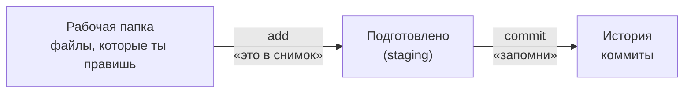

# 2. Коммит — как сохранить работу

**Коротко.** Изменённый файл попадает в историю в три шага: правишь его в рабочей
папке → отмечаешь «это войдёт в снимок» → делаешь коммит с сообщением.

## Три места



1. **Рабочая папка** (working directory) — обычные файлы на диске. Ты их правишь как угодно,
   git только замечает: «этот файл изменился».
2. **Подготовлено** (staging area, «индекс») — список того, что войдёт в следующий коммит.
   Зачем отдельный шаг: ты поправил пять файлов, а в коммит хочешь положить только два,
   остальные — следующим коммитом с другим сообщением.
3. **История** — коммиты. То, что здесь, уже не потеряется.

Аналогия: рабочая папка — стол, подготовленное — коробка, коммит — коробка заклеена,
подписана и поставлена на полку.

## Как сделать

> **В GitHub.** Открой файл → значок карандаша (**Edit this file**) → поправь →
> **Commit changes…**. В окне напиши сообщение и выбери, куда: прямо в текущую ветку
> или **Create a new branch for this commit and start a pull request** (о ветках — глава 3).
> На сайте шаги «подготовить» и «закоммитить» слиты в одну кнопку.
>
> **Попросить Claude.** «Закоммить изменения в кнопке, сообщение — „Кнопка: новый цвет фона“».
> Или просто «закоммить» — Claude сам посмотрит, что изменилось, и предложит сообщение.
> Попроси «покажи, что изменилось», если хочешь сначала увидеть разницу.

<small>Команды, которые выполнит Claude:</small>

```bash
git status                      # что изменилось и что подготовлено
git diff                        # сами изменения, строка за строкой
git add button.css              # подготовить файл
git commit -m "Кнопка: новый цвет фона"
git log --oneline               # история коротко: по строке на коммит
```

## Хорошее сообщение коммита

Сообщение читают через месяц, когда ищут «где сломалось». Пиши **что** и, если
не очевидно, **зачем**:

| Плохо | Хорошо |
|---|---|
| `fix` | `Кнопка: текст не обрезается на узких экранах` |
| `правки` | `Цвета: bg-accent-main темнее для контраста AA` |
| `wip` | `Шапка: черновик, без мобильной версии` |

Один коммит — одна мысль. Поправил цвет кнопки и заодно опечатку в другом
файле — лучше два коммита.

## Частые ошибки

- **Забыл подготовить файл.** `git status` покажет его в списке «not staged» —
  он не вошёл в коммит. Добавь и сделай ещё один коммит.
- **Опечатка в сообщении последнего коммита.** Пока коммит не отправлен на GitHub —
  попроси Claude «исправь сообщение последнего коммита». Если уже отправлен — оставь,
  это не страшно.
- **Закоммитил лишний файл.** Попроси Claude «убери файл X из последнего коммита,
  сам файл не удаляй». Если в файле пароль или ключ — глава 11.

## Как это в AID

- **Коммиты Claude делает сам, не спрашивая** — так записано в «Git-полномочиях»: «коммиты
  и разбиение работы по коммитам». Твоя часть — проверить, что вошло, и понятное сообщение.
- **Типы в сообщениях.** Для памяти скиллов и стандартов в `RickOBrian/aid` приняты
  префиксы: `docs: …` — гайд, `fix(skills): …` — правка скилла, `feat(skills): …` — новый скилл,
  `memory(<скилл>): …` — запись памяти. В отдельных репозиториях продуктов — коротко,
  по-русски или по-английски: что и зачем.

*Источники: `skills/_shared/protocols/git-workflow.md` §2 и «Git-полномочия» в корневом
`CLAUDE.md`, сверено 2026-10-09.*

## Проверь себя

1. Ты поправил `header.css` и `footer.css`, но хочешь закоммитить только шапку. Что делать?
   <details><summary>Ответ</summary>Подготовить (add) только `header.css` и сделать коммит.
   `footer.css` останется изменённым в рабочей папке — для следующего коммита.</details>
2. Что покажет `git status` сразу после коммита, если других правок нет?
   <details><summary>Ответ</summary>Что менять нечего: «nothing to commit, working tree clean».</details>
3. Перепиши сообщение `upd` для коммита, где поменялся отступ в карточке с 12 на 16.
   <details><summary>Ответ</summary>Например: `Карточка: отступ 12 → 16 по сетке`.</details>
