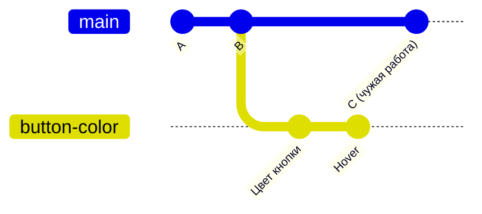

# 3. Ветки — работать, не мешая другим

**Коротко.** Ветка — это отдельная линия истории. Ты делаешь в ней коммиты сколько
угодно, а главная линия `main` остаётся рабочей. Когда работа готова — её сливают
в `main` (главы 5–6).

## Зачем

`main` — версия, которую все считают правильной: с неё собирают сайт, с неё начинают
новую работу. Если коммитить в неё недоделки, сломается у всех. Поэтому каждая задача
делается в своей ветке:



Пока ты работаешь в `button-color`, в `main` появляются чужие коммиты (`C`) —
и вы друг другу не мешаете.

## Что такое ветка на самом деле

Ветка — это просто **ярлычок на коммите** с именем. Когда ты делаешь новый коммит
в ветке, ярлычок переезжает на него. Создать ветку — мгновенно и бесплатно: файлы
не копируются.

**HEAD** — указатель «где я сейчас»: на какой ветке ты стоишь. Новый коммит ляжет
именно туда. Переключиться на другую ветку (switch, checkout) — значит переставить HEAD:
git подменит файлы в рабочей папке на версию из той ветки.

## Как сделать

> **В GitHub.** На странице репозитория — выпадающий список веток слева вверху (там написано
> `main`) → впиши имя новой ветки → **Create branch: имя from 'main'**.
> Ещё способ — при правке файла выбрать **Create a new branch for this commit…** (глава 2).
>
> **Попросить Claude.** «Создай ветку `button-color` от свежего `main`». Слово «свежего»
> важно: Claude сначала заберёт последние изменения с GitHub, и твоя работа начнётся
> с актуальной версии. Узнать, где ты: «на какой я ветке?».

<small>Команды:</small>

```bash
git branch                          # список веток, текущая отмечена *
git fetch                           # узнать, что нового на GitHub
git switch -c button-color origin/main   # новая ветка от свежего main и переход на неё
git switch main                     # вернуться на main
```

## Как называть ветки

Имя ветки видят все — пусть говорит, что в ней:

- коротко и латиницей, слова через дефис: `button-color`, `fix-header-overflow`;
- можно с префиксом вида работы: `feat/…` — новое, `fix/…` — исправление, `docs/…` — тексты;
- без пробелов и кириллицы.

## Частые ошибки

- **Работал прямо в `main`.** Ещё ничего не отправлено на GitHub? Попроси Claude:
  «перенеси мои коммиты из `main` в новую ветку `button-color`, а `main` верни как на GitHub».
- **Переключил ветку, а правки остались.** Незакоммиченные правки «едут» с тобой в другую
  ветку, если не мешают ей; если мешают — git не даст переключиться. Сначала закоммить или
  попроси Claude «отложи правки» (stash, глава 13).
- **Ветка от старого `main`.** Работа начнётся с устаревшей версии, при слиянии будут
  лишние конфликты. Всегда — «от свежего `main`».

## Как это в AID

- **Новая ветка — всегда от свежего `origin/main`**: правило для всех чатов —
  `git fetch && git switch -c <ветка> origin/main`.
- **`main` — это production.** Push в свою ветку даёт только превью, production не трогает;
  merge в `main` — выкатка на сайт (глава 7). Поэтому в `main` напрямую не коммитят.
- **Свою папку — только свою.** Каждый чат Claude в AID работает в своей папке и не
  переключает ветки в чужой — иначе один чат сменит ветку «из-под» другого посреди работы.
  Как это устроено — глава 8 и «Продвинутое» (worktree).

*Источник: корневой `CLAUDE.md` репозитория `RickOBrian/aid`, разделы «Три продукта —
три чата» и «Ветки и деплой», сверено 2026-10-09.*

## Проверь себя

1. Ты создал ветку. Сколько места на диске это заняло?
   <details><summary>Ответ</summary>Почти нисколько: ветка — ярлычок на коммите, файлы не копируются.</details>
2. Зачем просить ветку «от свежего `main`», а не просто «от `main`»?
   <details><summary>Ответ</summary>Твой локальный `main` может отставать от GitHub. «Свежий» —
   значит сначала забрать изменения, чтобы начать с актуальной версии.</details>
3. Придумай имя ветки для задачи «исправить обрезанный текст в карточке заказа».
   <details><summary>Ответ</summary>Например, `fix/order-card-text`.</details>
