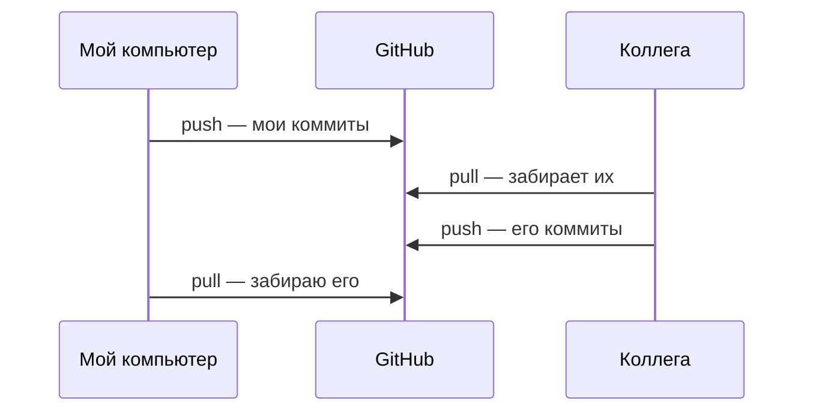

# 4. GitHub и синхронизация — clone, push, pull

**Коротко.** Твой репозиторий и репозиторий на GitHub — две копии, которые сами
не синхронизируются. **Push** отправляет твои коммиты на GitHub, **pull** забирает
чужие оттуда, **clone** — первый раз скачать репозиторий целиком.

## Четыре слова

| Действие | Что делает | Аналогия |
|---|---|---|
| **clone** | скачать репозиторий с GitHub со всей историей — один раз | взять копию папки |
| **push** | отправить свои новые коммиты на GitHub | выложить в общую папку |
| **fetch** | узнать, что нового на GitHub, ничего не меняя у себя | заглянуть в общую папку |
| **pull** | забрать новое с GitHub и соединить со своим (fetch + слияние) | забрать из общей папки к себе |



## origin — как зовут GitHub у тебя

Удалённый репозиторий у тебя записан под коротким именем. Обычно это **origin** —
«откуда склонировал». Поэтому в ответах Claude встречается `origin/main`: это «ветка
`main`, как она выглядит на GitHub — по последним сведениям». А просто `main` — твоя
локальная. Они могут различаться:

- **ahead** (впереди) — у тебя есть коммиты, которых нет на GitHub: пора push;
- **behind** (позади) — на GitHub есть коммиты, которых нет у тебя: пора pull.

## Как сделать

> **В GitHub.** Клонировать: зелёная кнопка **Code** → скопировать адрес (HTTPS) и отдать
> его Claude. Push и pull на сайте не нужны — там и так всегда версия GitHub.
> После твоего push на странице репозитория появится жёлтая плашка
> «*имя-ветки* had recent pushes» с кнопкой **Compare & pull request** — это следующий шаг (глава 5).
>
> **Попросить Claude.**
> - «Склонируй `https://github.com/owner/repo` в папку `D:\Projects\repo`».
> - «Запушь ветку» — отправить коммиты текущей ветки.
> - «Подтяни свежий `main`» или «забери изменения» — pull.
> - «Что нового на GitHub?» — fetch и рассказ, без изменений у тебя.

<small>Команды:</small>

```bash
git clone https://github.com/owner/repo.git
git push -u origin button-color   # первый push ветки: -u связывает её с GitHub
git push                          # следующие разы
git fetch                         # узнать новое
git pull                          # забрать и соединить
git status                        # покажет ahead / behind
```

## Частые ошибки

- **Push отклонён: rejected, fetch first.** На GitHub в этой ветке есть коммиты, которых
  у тебя нет (например, коллега запушил в ту же ветку). Сначала pull, потом push.
  Попроси Claude: «push отклонили — подтяни изменения и запушь снова».
- **«Я закоммитил, почему коллега не видит?»** Коммит есть только у тебя — нужен push.
- **Force-push «чтобы прошло».** `push --force` перезаписывает историю на GitHub и может
  стереть чужие коммиты. Не соглашайся на него, если не понимаешь, что именно перезапишется.
- **Pull с незакоммиченными правками.** Если чужие изменения задевают те же файлы — git
  остановится. Закоммить свои правки и повтори pull.

## Как это в AID

- **Push в свою ветку Claude делает сам**: это даёт превью, production не затрагивается.
- **Спрашивает до действия**: push прямо в `main` в обход PR, force-push, удаление веток.
  Если Claude спросил «можно сделать force-push?» — это и есть такой случай: ответь,
  только когда понимаешь последствия.
- У инженеров AID в локальном клоне обычно несколько удалённых репозиториев:
  `origin` / `upstream` — общий `RickOBrian/aid`, `fork` — свой форк. Зачем форк — глава 8.

*Источник: «Git-полномочия» и «Ветки и деплой» в корневом `CLAUDE.md` репозитория
`RickOBrian/aid`, сверено 2026-10-09.*

## Проверь себя

1. Чем fetch отличается от pull?
   <details><summary>Ответ</summary>Fetch только узнаёт, что нового на GitHub, твои файлы
   не меняются. Pull забирает новое и соединяет с твоей веткой.</details>
2. `git status` пишет «Your branch is ahead of 'origin/main' by 2 commits». Что это значит?
   <details><summary>Ответ</summary>У тебя два коммита, которых нет на GitHub. Их нужно
   отправить (push) — или, если ты на `main`, перенести в свою ветку (глава 3).</details>
3. Push отклонён. Claude предлагает force-push. Что спросить у него прежде, чем согласиться?
   <details><summary>Ответ</summary>Чьи коммиты на GitHub будут перезаписаны и почему нельзя
   сначала сделать pull. Обычно правильный путь — pull, а не force.</details>
