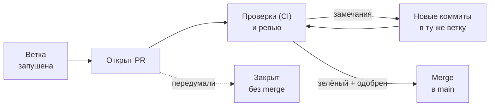

# 5. Pull Request — показать работу и получить ревью

**Коротко.** Pull Request (PR, «пулл-реквест», в GitLab — Merge Request) — это
предложение: «вот моя ветка, давайте сольём её в `main`». На странице PR видно все
изменения, их обсуждают, по ним запускаются проверки, и только потом — merge.

## Зачем, если можно сразу слить

- **Вторая пара глаз.** Коллега замечает то, что ты пропустил.
- **Проверки.** На каждый PR автоматически запускаются тесты и сборка (глава 7) —
  сломанное не попадёт в `main`.
- **Память.** Через полгода по PR видно, что и почему поменяли, кто согласовал.

## Жизнь PR



## Как открыть

> **В GitHub.**
> 1. После push — жёлтая плашка с кнопкой **Compare & pull request**. Нет плашки —
>    вкладка **Pull requests** → **New pull request** → выбери свою ветку.
> 2. Сверху проверь направление: **base: main ← compare: твоя-ветка**. Base — куда сливаем.
> 3. **Название** — что делает PR, как сообщение коммита: «Кнопка: новый цвет фона».
> 4. **Описание** — что сделано, зачем, как проверить, на что смотреть ревьюеру.
>    Ссылка на задачу, если есть: `Closes #12` закроет issue №12 при merge.
> 5. **Create pull request**. Или стрелка рядом → **Create draft pull request**, если
>    работа ещё не готова, но хочется показать (черновик нельзя слить, пока не нажмёшь
>    **Ready for review**).
>
> **Попросить Claude.** «Запушь и открой PR в `main`, в описании — что сделано и как проверить».
> Claude пришлёт ссылку на PR.

<small>Команда (GitHub CLI, ею пользуется Claude):</small>

```bash
gh pr create --base main --title "Кнопка: новый цвет фона" --body "Что и зачем…"
```

## Страница PR

| Вкладка | Что там |
|---|---|
| **Conversation** | описание, комментарии, статус проверок, кнопка merge внизу |
| **Commits** | коммиты ветки |
| **Checks** | результаты проверок: что прошло, что упало и почему |
| **Files changed** | сами изменения: красное — удалено, зелёное — добавлено |

## Ревью

**Ревьюер:** вкладка **Files changed** → наведи на строку → **+** → комментарий.
Закончил — **Review changes** и одно из трёх:

- **Comment** — просто замечания;
- **Approve** — «одобряю, можно сливать» («апрув»);
- **Request changes** — «нужно поправить до merge».

**Автор:** поправил по замечаниям — просто сделай новые коммиты **в ту же ветку** и push.
PR обновится сам, новый PR открывать не нужно. На комментарий ответь или нажми
**Resolve conversation**, когда вопрос решён.

> **Попросить Claude.** «Прочитай комментарии в PR и поправь» — Claude прочитает ревью,
> внесёт правки и запушит в ту же ветку.

## Частые ошибки

- **Перепутаны base и compare** — PR предлагает слить `main` в твою ветку. Закрой и открой заново.
- **Огромный PR.** 40 файлов о разном ревьюить невозможно. Одна задача — одна ветка — один PR.
- **Новый PR на каждое исправление.** Не нужно: коммиты в ту же ветку попадают в тот же PR.
- **Пустое описание.** Ревьюер не знает, что проверять. Хотя бы: что, зачем, как проверить.

## Как это в AID

- **Каждый PR в `RickOBrian/aid` получает превью сайта** — `preview.aidteam.pro/pr-N/`,
  где N — номер PR. Ссылка приходит комментарием в PR, при закрытии PR превью удаляется.
- **Кто сливает.** В продуктах с отдельным репозиторием (Library Updater, этот гайд) PR сливает
  владелец продукта. В `RickOBrian/aid` Claude может слить сам, если CI зелёный, PR прочитан
  целиком и меняет только документы или входит в принятое решение (ADR); остальное —
  с согласия Principal Designer.
- **PR из форка.** У инженеров нет права записи в `RickOBrian/aid`: они открывают PR из своего
  форка (глава 8). Проверки на таком PR запускаются после подтверждения владельцем репозитория.
- **Пример.** Первый PR этого гайда — [arturuxui/aid-git-guide#1](https://github.com/arturuxui/aid-git-guide/pull/1):
  ветка `docs/plan-issue-172`, один файл, описание «что и зачем».

*Источники: «Git-полномочия» в корневом `CLAUDE.md`, `docs/hub/ORCHESTRATION.md` §9,
`pages/aid-portal/CLAUDE.md` — репозиторий `RickOBrian/aid`, сверено 2026-10-09.*

## Проверь себя

1. Ревьюер нажал **Request changes**. Ты поправил. Что дальше — новый PR?
   <details><summary>Ответ</summary>Нет: коммит в ту же ветку и push. PR обновится,
   ревьюер посмотрит снова.</details>
2. Чем draft PR отличается от обычного?
   <details><summary>Ответ</summary>Черновик видно и можно обсуждать, но слить нельзя,
   пока автор не нажмёт **Ready for review**.</details>
3. Что значит `base: main ← compare: fix/header`?
   <details><summary>Ответ</summary>Изменения из ветки `fix/header` предлагается слить в `main`.</details>
