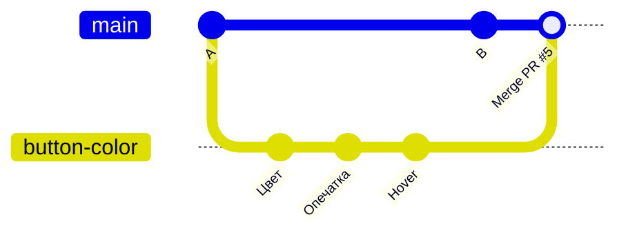
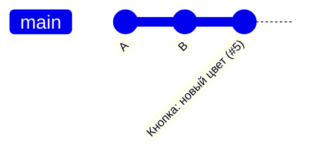

# 6. Merge и конфликты

**Коротко.** Merge («мерж», «слить», «влить») — соединить историю двух веток: изменения
из твоей ветки попадают в `main`. Обычно git делает это сам. Если два человека поменяли
одну и ту же строку по-разному — это **конфликт**, и выбрать, как правильно, должен человек.

## Три кнопки merge на GitHub

Внизу страницы PR — зелёная кнопка, у неё стрелка с тремя вариантами. Все три кладут
твою работу в `main`, но по-разному выглядит история:

**Create a merge commit** — история ветки сохраняется целиком, плюс появляется
коммит-«шов» `Merge pull request #5`.



**Squash and merge** — все коммиты ветки сжимаются в один коммит в `main`. История `main`
чистая: один PR — один коммит. Промежуточные «опечатка», «ещё правка» не засоряют её.



**Rebase and merge** — коммиты ветки по одному переставляются в конец `main`, без шва.
Подробнее о rebase — глава 13.

| Вариант | История `main` | Когда |
|---|---|---|
| Merge commit | всё как было + шов | важна каждая ступенька работы |
| **Squash and merge** | один коммит на PR | чаще всего — по умолчанию в небольших командах |
| Rebase and merge | все коммиты, без шва | когда коммиты ветки уже аккуратные |

После merge GitHub предложит **Delete branch** — удали: ветка своё отработала,
вся её работа уже в `main`.

## Fast-forward — merge без merge

Если пока ты работал, в `main` ничего не появилось, git просто передвигает ярлычок `main`
вперёд на твой последний коммит — «перемотка». Никакого шва не нужно.

## Конфликт

Ты в своей ветке поменял цвет кнопки на синий, коллега в своей — на зелёный, и его
PR слили первым. Теперь git не знает, какой цвет правильный. На странице твоего PR —
«This branch has conflicts that must be resolved».

В файле конфликт выглядит так (в редакторе на сайте GitHub):

```
<<<<<<< button-color
background: var(--bg-accent-main);
=======
background: var(--bg-positive-main);
>>>>>>> main
```

- между `<<<<<<<` и `=======` — твоя версия;
- между `=======` и `>>>>>>>` — версия из `main`.

Если конфликт решает Claude у тебя на компьютере, подписи другие, а смысл тот же:
`<<<<<<< HEAD` — твоя версия (HEAD — «где я сейчас», глава 3), `>>>>>>> origin/main` —
версия из `main` на GitHub.

Решить конфликт — оставить правильный вариант (или соединить оба), удалить
строки-маркеры, закоммитить.

> **В GitHub.** Простой конфликт решается прямо на сайте: **Resolve conflicts** →
> поправь файл, удали маркеры → **Mark as resolved** → **Commit merge**. Кнопки нет,
> если конфликт сложный — тогда через Claude.
>
> **Попросить Claude.** «В PR конфликт с `main` — покажи, в чём он, и предложи решение».
> Claude подтянет `main`, покажет обе версии и спросит, какую оставить. **Решение — твоё**:
> только ты знаешь, какой цвет правильный. Не соглашайся на «оставил свою версию», не
> посмотрев, что было в чужой.

<small>Команды:</small>

```bash
git fetch
git merge origin/main      # подтянуть main в свою ветку — тут и всплывёт конфликт
# правка файла: оставить нужное, удалить маркеры
git add button.css
git commit                 # коммит слияния
git push
```

## Как реже ловить конфликты

- Маленькие PR, которые живут день-два, а не две недели.
- Перед началом работы — ветка от свежего `main`.
- Если PR висит долго — время от времени подтягивай `main` в свою ветку
  (на GitHub — кнопка **Update branch** в PR).
- Договаривайтесь, кто какие файлы правит (глава 8).

## Как это в AID

- **Merge в `main` — это выкатка в production.** В `RickOBrian/aid` после merge сайт
  Presentbook обновляется сам. Поэтому merge — осознанное решение, а не «нажал, чтобы ушло».
- **Squash and merge** — так сливают PR в продуктах инженеров (Library Updater, Components
  Swapper, этот гайд): один PR — один коммит в `main`.
- **Не всё Claude сливает сам.** Релиз, CI, зависимости, корневой `CLAUDE.md`, удаления —
  только с согласия Principal Designer (глава 7).

*Источник: «Ветки и деплой», «Git-полномочия» в корневом `CLAUDE.md` репозитория
`RickOBrian/aid`; раздел «Git» в `CLAUDE.md` плагинов, сверено 2026-10-09.*

## Проверь себя

1. В ветке 7 коммитов: «черновик», «опечатка», «ещё правка»… Какой вариант merge выбрать,
   чтобы в `main` был порядок?
   <details><summary>Ответ</summary>Squash and merge — в `main` будет один коммит с названием PR.</details>
2. Что значит блок между `=======` и `>>>>>>> main`?
   <details><summary>Ответ</summary>Версия этого места из ветки `main`.</details>
3. Claude решил конфликт, оставив твою версию. Что проверить?
   <details><summary>Ответ</summary>Что было в чужой версии и не нужно ли было её сохранить
   или соединить с твоей. Конфликт решает человек, который понимает смысл правки.</details>
