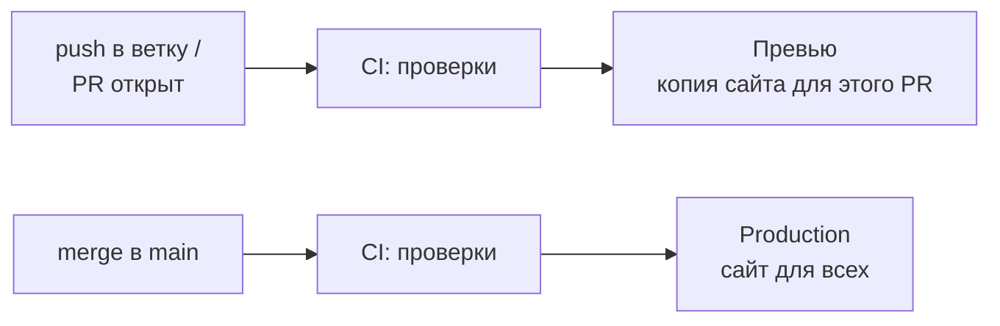

# 7. CI и деплой — проверки, превью, production

**Коротко.** **CI** (continuous integration) — робот, который на каждый PR и push сам
запускает проверки: собирается ли проект, проходят ли тесты, в порядке ли документы.
**Деплой** (deploy, «выкатка») — когда проект публикуется: на превью для проверки или
в **production** — туда, где его видят все пользователи.

## Зачем робот

Человек забывает прогнать тесты. Робот — нет. Если проверки красные, сломанное
не попадёт в `main`, а значит, не сломается у всех и не уедет на сайт.

## Значки

На странице PR, у каждого коммита и в списке PR:

| Значок | Что значит | Что делать |
|---|---|---|
| 🟡 жёлтый кружок | проверки ещё идут | подождать, обычно минуты |
| ✅ зелёная галочка | всё прошло | можно сливать (если есть одобрение) |
| ❌ красный крестик | что-то упало | открыть и разобраться — не сливать |

> **В GitHub.** В PR, блок проверок над кнопкой merge, или вкладка **Checks**. У упавшей
> проверки — **Details**: откроется журнал, внизу обычно видна ошибка.
>
> **Попросить Claude.** «CI в PR #12 красный — разберись, почему, и почини». Claude прочитает
> журнал проверки, найдёт причину, поправит и запушит в ту же ветку — проверки запустятся заново.

## Откуда берутся проверки

Их описывают файлы в репозитории, в папке `.github/workflows/` — это GitHub Actions.
Каждый файл говорит: «когда открыт PR — возьми код, установи зависимости, запусти
вот эти команды». Сам писать их не нужно; достаточно знать, где они живут и что их
правка — дело ответственное: сломанная проверка пропустит сломанный код.

## Превью и production

- **Превью** (preview) — временная копия сайта с изменениями твоего PR. Её можно открыть,
  посмотреть глазами, показать коллеге. Пользователи её не видят.
- **Production** («прод») — настоящий сайт. Туда изменения попадают после merge в `main`.

Отсюда главное правило: **merge в `main` = выкатка для всех**.

## Частые ошибки

- **«Проверка красная, но я уверен, что всё ок» — и merge.** Красное в `main` ломает работу
  всем, кто начнёт ветку после тебя. Сначала разберись.
- **Перезапуск до победы.** Иногда проверка падает случайно (сеть, зависший сервис) — тогда
  перезапуск помогает (**Re-run jobs**). Но если падает одинаково — это ошибка, а не случайность.
- **Ждать CI там, где его нет.** Нет блока проверок в PR — значит, CI в репозитории не настроен,
  и всё проверяешь ты сам.

## Как это в AID

- **Проверки `RickOBrian/aid`** (файл `.github/workflows/checks.yml`) на каждом PR:
  **Документы** — форма гайдов, живость ссылок, версии; **Портал** — типы, тесты и сборка
  сайта Presentbook; **Плагин** — Token Comparator и его сервер.
  «Зелёный PR не ломает чужой продукт по тестам и сборке».
- **Превью Presentbook** — `preview.aidteam.pro/pr-N/`, ссылка приходит комментарием в PR.
  **Production** — `aidteam.pro`: после merge в `main` сайт выкладывается сам.
- **Продукты инженеров** — свой CI в своём репозитории: у Library Updater это
  `typecheck`, `test`, `build`, и они же должны пройти локально перед коммитом.
- **PR из форка.** Проверки GitHub Actions на PR из форка запускаются после подтверждения
  владельцем репозитория; красный Vercel на таких PR — ожидаем, это не ошибка автора.
- **Правка CI — только с согласия Principal Designer**: `.github/`, зависимости, конфиги хостинга.
- **Новый продукт попадает в CI вместе с первым кодом**, который есть чем проверять.

*Источники: `.github/workflows/checks.yml`, `presentbook-yc.yml`, корневой `CLAUDE.md`
(«Ветки и деплой», «Git-полномочия»), `pages/aid-portal/CLAUDE.md`, доска `docs/hub/boards/lu.md`
(AID-LU-3) — репозиторий `RickOBrian/aid`, сверено 2026-10-09.*

## Проверь себя

1. В PR красный крестик, ревьюер одобрил. Сливать?
   

Ответ
Нет. Сначала открыть **Details**, понять причину и
   починить. Одобрение ревьюера не отменяет упавшую проверку.

2. Ты поменял цвет на превью PR — его увидели пользователи сайта?
   

Ответ
Нет. Превью видят только те, у кого есть ссылка.
   Пользователи увидят изменения после merge в `main`.

3. Где лежат описания проверок?
   

Ответ
В репозитории, в `.github/workflows/`.

