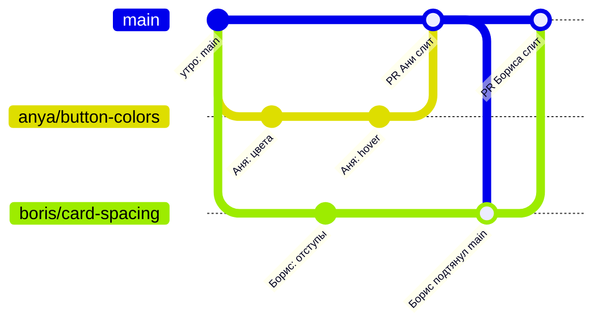
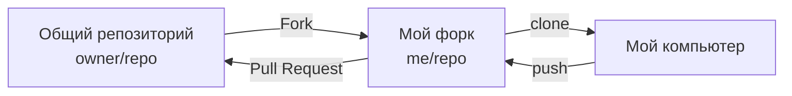

# 8. Работа в команде — несколько человек параллельно

**Коротко.** Каждый работает в своей ветке от свежего `main`, показывает работу через PR,
сливает после проверок и ревью. Всё остальное в этой главе — как сделать, чтобы при этом
не наступать друг другу на ноги.

## Один день из жизни команды

Аня меняет цвета кнопок, Борис — отступы в карточке. Оба начинают утром.

1. **Утро.** Оба создают ветки от свежего `main`.
2. **День.** Каждый коммитит в свою ветку и пушит — работа сохранена на GitHub, но `main` не трогает.
3. **Аня готова первой.** PR → CI зелёный → ревью → **Squash and merge**. В `main` появились её цвета.
4. **Борис.** Его ветка теперь отстаёт от `main`. GitHub в PR покажет «This branch is out-of-date»;
   Борис нажимает **Update branch** (или просит Claude «подтяни `main` в мою ветку»). Они правили
   разные файлы — конфликта нет, git соединил сам.
5. **Борис сливает.** В `main` — работа обоих.

Если бы оба правили одну строку — на шаге 4 Борис получил бы конфликт и решил его (глава 6).

## Правила, которые экономят нервы

- **Своя ветка — только своя.** Не пушь в чужую ветку без договорённости: человек может
  в этот момент работать в ней, и у него не пройдёт push.
- **Не переписывай общую историю.** Force-push в ветку, которой пользуется кто-то ещё, и
  тем более в `main`, стирает чужую работу.
- **Маленькие PR, короткие ветки.** Чем дольше живёт ветка, тем дальше она уходит от `main`
  и тем больнее конфликты.
- **Договаривайтесь о территории.** Кто какие файлы правит — лучше знать заранее. Двое
  правят один файл одновременно — обсудите, кто первый.
- **Держи `main` рабочим.** Всё, что в `main`, — проверено и годится как точка старта для любого.
- **Прежде чем начать — свежий `main`.** Прежде чем слить — актуальная ветка и зелёный CI.

## Форк — своя копия чужого репозитория

Иногда у тебя нет права пушить в общий репозиторий: он чужой, открытый для всех, или
так устроена команда. Тогда делают **форк** (fork) — твою копию репозитория на GitHub,
в твоём аккаунте. В неё ты пушишь свободно, а PR открываешь **из форка в общий репозиторий**.

> **В GitHub.** Кнопка **Fork** справа вверху на странице репозитория → **Create fork**.
> Форк отстал от оригинала — на странице форка **Sync fork** → **Update branch**.
> PR из форка: после push в форк — **Contribute** → **Open pull request**.
>
> **Попросить Claude.** «Сделай форк `owner/repo`, склонируй и настрой, чтобы я мог забирать
> изменения из оригинала». Claude запишет оригинал под именем `upstream`, а форк — `origin`
> (или под другим именем, как принято в проекте).

## Как это в AID

- **Задачи — у каждого свой чат и своя папка.** В AID каждый продукт ведёт свой чат Claude,
  у каждого — своя папка (отдельный worktree или клон) и своя ветка. Правило: «Своя папка — только
  своя» — не переключать ветки и не править файлы в чужой папке.
- **Чужой продукт не правится молча.** Задача задевает чужую территорию — остановиться и
  написать владельцу через Штаб. Места, где продукты влияют друг на друга, описаны таблицей
  «Стыки между продуктами» в корневом `CLAUDE.md`: у каждого стыка есть владелец.
- **Инженеры работают из форков.** Права записи в `RickOBrian/aid` им не выдают: `main` не
  защищена, и запись дала бы доступ ко всему. Свою доску и правки инженер присылает PR из форка.
- **Задачи между людьми — GitHub Issues.** Issue с заголовком `[TASK @логин] что сделать`;
  получатель отвечает «Беру» или «Передаю @логин». Решение владельца пишется в комментарии
  дословно. Репозиторий публичный — в issues только логины, без имён и контактов.
- **Как избежать конфликтов: «один файл на человека».** Журналы памяти скиллов каждый пишет
  в свой файл `log.<фамилия>.json` — два человека никогда не правят один файл.

*Источники: корневой `CLAUDE.md` («Три продукта — три чата», «Стыки между продуктами»),
`docs/hub/ORCHESTRATION.md` §9, `skills/_shared/protocols/git-workflow.md` §3 —
репозиторий `RickOBrian/aid`, сверено 2026-10-09.*

## Проверь себя

1. PR коллеги слили раньше твоего, GitHub пишет «out-of-date». Что делать?
   

Ответ
Подтянуть `main` в свою ветку (**Update branch** или попросить
   Claude), дождаться зелёного CI и сливать. Если будет конфликт — решить его.

2. Коллега попросил «поправь опечатку в моей ветке». Можно просто запушить туда?
   

Ответ
Можно, раз он сам попросил, — но лучше сказать, когда
   запушил, чтобы он сделал pull перед своим следующим push. Без договорённости — нельзя.

3. У тебя нет права записи в репозиторий команды. Как предложить изменение?
   

Ответ
Сделать форк, запушить ветку в него и открыть PR из форка
   в репозиторий команды.

